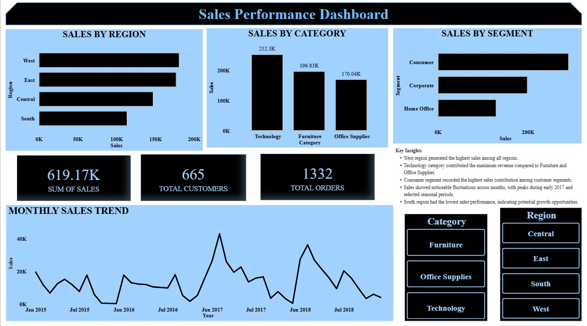

# Sales Analytics Dashboard

## 📊 Project Overview
This project presents an interactive Sales Analytics Dashboard developed using Power BI to analyze and visualize retail sales data. The dashboard provides insights into regional sales performance, customer segments, category-wise revenue distribution, and monthly sales trends. 

The objective of this project is to transform raw sales data into meaningful business insights through data cleaning, visualization, and interactive reporting techniques. The dashboard enables users to identify top-performing regions and categories, understand customer purchasing behaviour, and monitor sales patterns over time.

## 🚀 Features
- Sales by Region
- Sales by Category
- Sales by Segment
- Monthly Sales Trend
- KPI Cards
- Interactive Filters & Slicers

## 🛠 Tools Used
- Power BI
- Data Cleaning
- Data Visualization

## 📈 Key Insights
- West region generated the highest sales
- Technology category contributed maximum revenue
- Consumer segment dominated sales contribution
- Sales showed noticeable fluctuations across months

## 📌 Conclusion
This dashboard helps analyze sales performance, customer behaviour, and regional trends through interactive visualizations and business insights.

## 📷 Dashboard Preview

